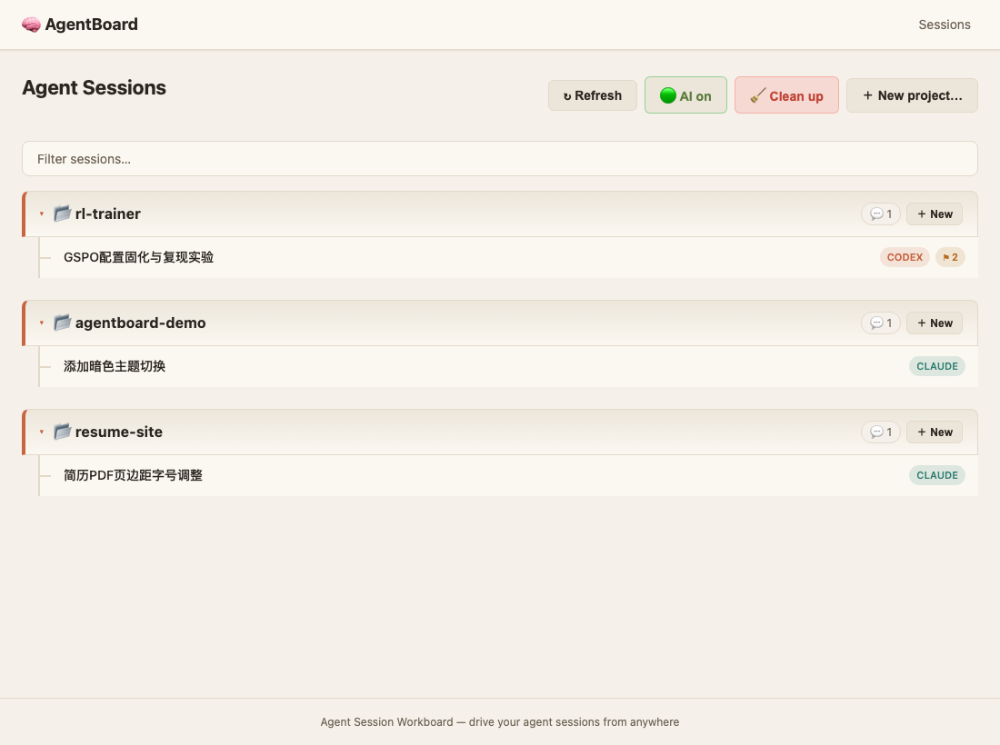
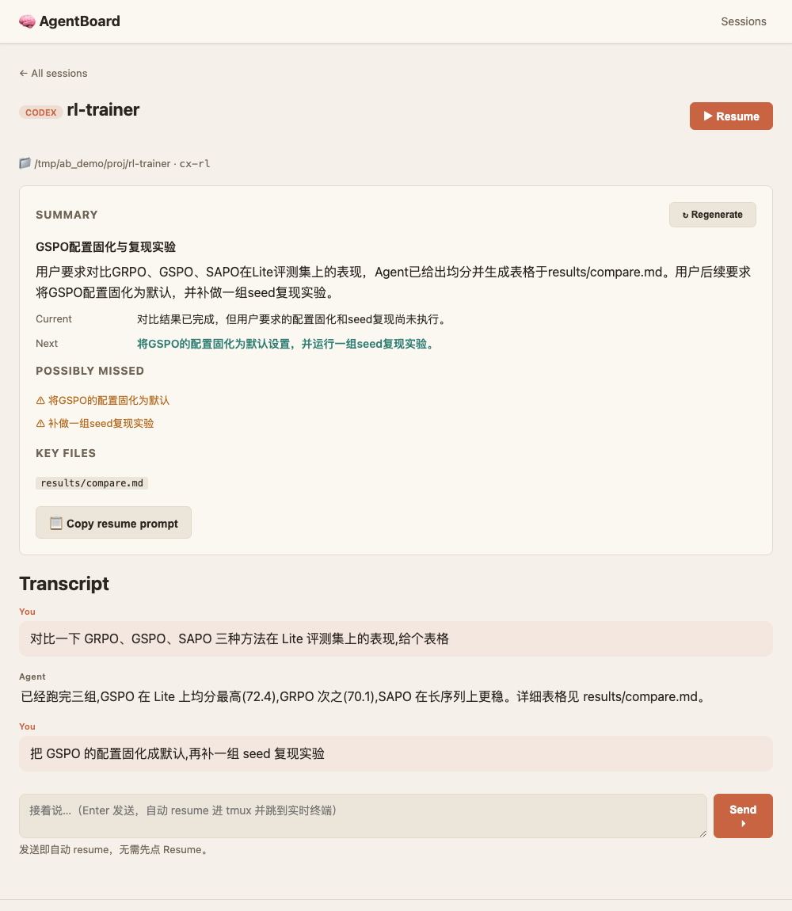
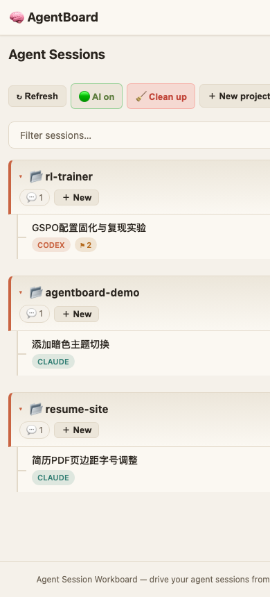

# AgentBoard 🧠

*[English](README.md) · [中文](README.zh-CN.md)*

I leave Codex and Claude Code running on my Mac and then walk away from it.
AgentBoard is how I check in from my phone: see what the agents are doing, type
a reply, or pull up something I ran last week and keep going. That's really all
it's for.



## What it is

A little web app in front of your agent sessions. A session is just a tmux pane
running an agent CLI, so AgentBoard lists the ones you have open (on this
machine, or on boxes you reach over SSH) next to the Codex and Claude
conversations already sitting on disk. Open any of them and start typing.

If you've added an LLM key, it also gives each conversation a short title and a
recap of where things stand, what's next, and the loose ends you probably forgot,
so you don't have to re-read a wall of text to remember what you were doing.



## How it works

It leans on three tmux commands and not much else:

- It finds running agents with `tmux list-panes` (or `ssh <host> tmux
  list-panes`), and your past conversations by reading the JSONL logs Codex and
  Claude already write under `~/.codex` and `~/.claude`. No database, and nothing
  to install on the remote machines.
- It types into a pane with `send-keys` and shows you the output with
  `capture-pane`. The terminal tab gets a real pty stream.
- When you open an old conversation and hit send, it brings that conversation
  back up in tmux and delivers your message. You don't click "resume" first.

Expose it to the internet and one token guards everything.

## Quickstart

```bash
uv sync
uv run agentboard init        # writes ~/.agentboard/config.yaml
uv run agentboard web         # local hub at http://127.0.0.1:8765
```

Agents already running in tmux show up on their own. To start a fresh one, hit
**＋ New**.

## Getting to it from your phone

```bash
uv run agentboard web --remote
```

This binds publicly and prints a token, the access URLs, and a QR code. Scan the
QR with your phone and you're in. The token sticks around as a cookie for 30
days, so you only do this once per device. Lost the token? `agentboard token`
prints it again; `agentboard token --rotate` gives you a new one. How you expose
the port is up to you: Tailscale, `cloudflared`, an SSH reverse tunnel, whatever.



A heads-up on speed: it's snappy on the same Wi-Fi and slower from a different
network, especially if your traffic goes through a relay. That lag is only in the
controls. The agent itself keeps working on your machine at full speed.

## CLI

| Command | What it does |
|---|---|
| `agentboard init` | Create `~/.agentboard/config.yaml` |
| `agentboard sessions` | List agent sessions across machines |
| `agentboard send <machine> <name> <msg…>` | Type a message into a session |
| `agentboard new <machine> <cwd> [--command codex] [--name x]` | Start a session |
| `agentboard kill <machine> <name>` | Kill a session |
| `agentboard summarize [-m machine] [-n name]` | Build LLM summary cards |
| `agentboard token [--rotate]` | Print the access token + URLs + QR (or rotate it) |
| `agentboard web [--port 8765] [--remote]` | Start the web hub |

## Configuration

`~/.agentboard/config.yaml`:

```yaml
workspace:
  data_dir: ~/.agentboard

machines:
  - name: local
    type: local
    codex_home: ~/.codex
    claude_home: ~/.claude
    tmux: true
  - name: h200
    type: ssh
    host: h200          # must work as `ssh h200` (use ~/.ssh/config)
    codex_home: ~/.codex
    claude_home: ~/.claude
    tmux: true

llm:                    # optional — only used for titles & summaries
  base_url: https://api.deepseek.com
  model: deepseek-v4-flash
  api_key_env: DEEPSEEK_API_KEY

remote:
  enabled: false        # `web --remote` flips this on
  bind_host: "0.0.0.0"
```

Without an LLM key the titles are just the first line of your opening message;
add one and they get written properly.

## Privacy

Everything stays on your machine under `~/.agentboard/`. A conversation only goes
to an LLM when you ask for a title or summary, and secrets (API keys, tokens,
private keys) are stripped out first. Remote access is off until you turn it on,
and gated by the token when you do.

## Development

```bash
uv sync --extra dev
uv run --extra dev pytest
uv run --extra dev ruff check
```

## Contributing

This started as a personal tool, so the rough edges you run into are genuinely
useful to hear about. Issues, PRs, and stars are all welcome.

## Acknowledgements

The interactive side (tmux-first sessions driven from a web hub) took cues from
[StarAgent](https://github.com/SiriusNEO/StarAgent).

## License

MIT
